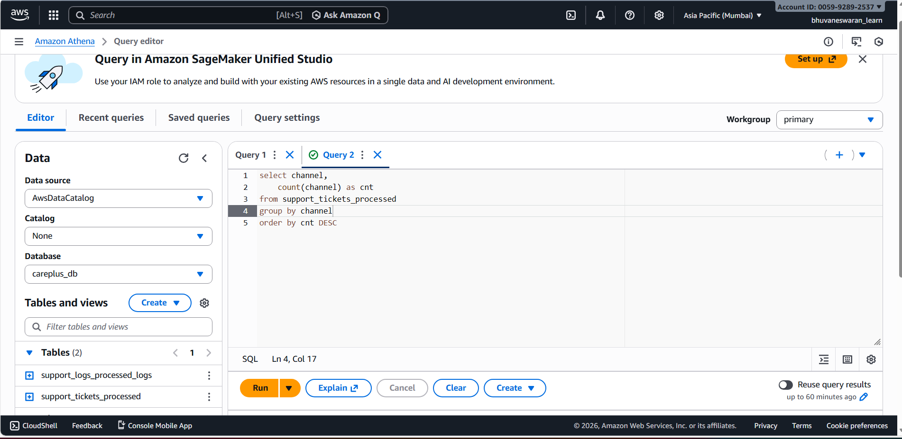
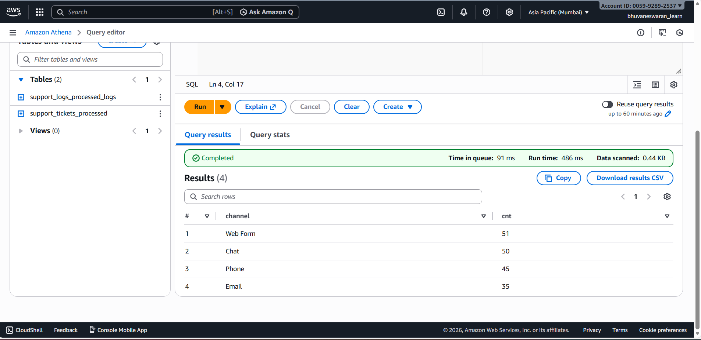

# 📊 Ad-Hoc Analysis Using Amazon Athena

> Interactive SQL analysis on S3-based data using AWS Athena and Glue

---

## 🎯 Learning Objectives

- ✅ Understand the fundamentals of Ad-Hoc Analysis
- ✅ Learn how Amazon Athena works with S3-based data
- ✅ Explore AWS Glue Crawlers for schema discovery
- ✅ Perform exploratory SQL analysis on semi-structured data

---

---

## 🛠️ Tools & Services Used

| Tool | Purpose |
|------|---------|
| **Amazon Athena** | Serverless SQL query engine |
| **Amazon S3** | Data storage and query result location |
| **AWS Glue** | Metadata catalog and crawler |
| **AWS Glue Data Catalog** | Central schema repository |
| **SQL** | Query language for data analysis |

---

## 🧩 Implementation Steps

### 1️⃣ Athena Query Editor Setup

Launched the Amazon Athena Query Editor from the AWS Console
- ✓ Configured an S3 bucket location to store query results
- ✓ Ensured proper permissions for Athena to read/write from S3

> **📌 Note:** Athena requires a query result location in S3 before executing queries.

### 2️⃣ Database Creation

Created a dedicated database to organize datasets:

```sql
CREATE DATABASE careplus_db;
```

- ✓ Used this database as the primary workspace for analysis

### 3️⃣ Table Creation Using AWS Glue Crawler

- ✓ Configured AWS Glue Crawlers to automatically detect schema
- ✓ Crawled data stored in S3 for:
  - `support_tickets`
  - `support_logs`
- ✓ Registered discovered schemas into the Glue Data Catalog
- ✓ Tables became immediately available for querying in Athena

> **📌 Note:** Glue Crawlers eliminate the need for manual schema definition.

### 4️⃣ Ad-Hoc Data Analysis with SQL

Executed exploratory SQL queries including:
- Record counts
- Filtering by status or priority
- Time-based analysis
- Log volume and ticket trends

Used Athena's interactive querying to quickly validate assumptions and explore patterns.

**Example Query:**

```sql
SELECT status, COUNT(*) as ticket_count
FROM support_tickets
GROUP BY status;
```

---

## 📈 Key Learnings

- Athena enables instant insights without data movement
- Glue Crawlers simplify schema management
- Ad-Hoc analysis is ideal for quick exploration and one-time insights
- Serverless architecture reduces operational overhead and cost
- SQL remains a powerful tool for large-scale data analysis


##  Analysis:

1.Query : Analysis on Channel and their count in support tickets


2.Result:
