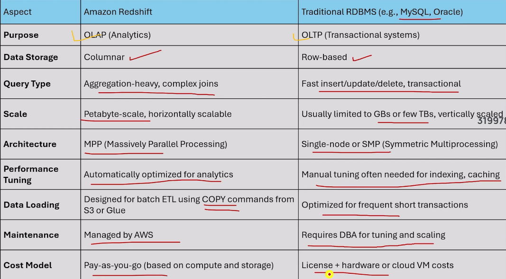

# 📊 Amazon Redshift

## 🧠 Overview

Amazon Redshift is a fully managed cloud data warehouse designed for high-performance analytical workloads.
Unlike Amazon Athena (schema-on-read), Redshift follows a schema-on-write approach, making it ideal for repeated analysis, BI dashboards, and large-scale aggregations.

This document explains how ad-hoc analysis was performed on support ticket data stored in Amazon S3 using Amazon Redshift.

## 🎯 Learning Objectives

- Understand Redshift architecture and usage
- Set up Redshift (Serverless / Provisioned)
- Load data from Amazon S3 using COPY
- Perform ad-hoc SQL analysis
- Compare Redshift with Athena

## 🛠️ Tools & Services Used

| Service | Purpose |
|---------|---------|
| Amazon Redshift | Data warehouse |
| Amazon Redshift Serverless | On-demand analytics |
| Amazon S3 | Source data storage |
| AWS IAM | Secure S3 access |
| SQL | Data analysis |

## 🧩 Implementation Steps

### 1️⃣ Redshift Setup

Preferred: Amazon Redshift Serverless
- Created Namespace & Workgroup
- No cluster sizing required
- Ideal for ad-hoc queries

💡 Best choice if you are already using Athena.

### 2️⃣ IAM Role Configuration

Created an IAM role with:
- AmazonS3ReadOnlyAccess
Attached role to Redshift workgroup to allow loading data from S3.

### 3️⃣ Schema Creation

```sql
CREATE SCHEMA careplus_schema;
SET search_path TO careplus_schema;
```

### 4️⃣ Table Creation

```sql
CREATE TABLE support_tickets (
    ticket_id INT,
    channel VARCHAR(50),
    status VARCHAR(30),
    priority VARCHAR(20),
    created_at TIMESTAMP
);
```

> **🔑 Note:** Redshift does not auto-detect schema like Glue Crawlers.

### 5️⃣ Data Loading from S3

```sql
COPY support_tickets
FROM 's3://your-bucket/support_tickets/'
IAM_ROLE 'arn:aws:iam::<account-id>:role/RedshiftS3Role'
FORMAT AS CSV
IGNOREHEADER 1;
```

### 6️⃣ Ad-Hoc Analysis Queries

#### Channel-wise Ticket Count

```sql
SELECT channel, COUNT(*) AS ticket_count
FROM support_tickets
GROUP BY channel
ORDER BY ticket_count DESC;
```

#### Status Analysis

```sql
SELECT status, COUNT(*) 
FROM support_tickets
GROUP BY status;
```

## 📈 Key Learnings

- Redshift offers faster performance than Athena for repeated queries
- Requires explicit schema and data loading
- Serverless mode is cost-efficient for ad-hoc analysis
- Ideal backend for Power BI / QuickSight

## 🔄 Athena vs Redshift

| Feature | Athena | Redshift |
|---------|--------|----------|
| Data Access | Direct S3 | Loaded tables |
| Schema | On Read | On Write |
| Cost | Per query | Compute-based |
| Best For | Exploration | Dashboards |

## 🏁 Conclusion

Use Athena for:
- One-time exploration
- Raw log analysis

Use Redshift for:
- Business reporting
- BI dashboards
- Complex joins & aggregations

## 🧱 Architecture Diagram

### Athena Architecture

```
S3 (Raw Data)
     ↓
AWS Glue Crawler
     ↓
Glue Data Catalog
     ↓
Amazon Athena
```

### Redshift Architecture

```
S3 (Raw Data)
     ↓  COPY
Amazon Redshift
     ↓
BI / Ad-Hoc Queries
```

## ❗ Troubleshooting: Redshift SubscriptionRequiredException

### ❌ Error

```
SubscriptionRequiredException
The AWS Access Key Id needs a subscription for the service
```

### ✅ Why This Happens (Very Common)

Even though Redshift shows "Free Tier", it still requires:
- ✔ Explicit service activation
- ✔ Valid billing method attached

Athena works because:
- It's automatically enabled
- Pure pay-per-query

Redshift requires manual opt-in.

### 📚 Reference

