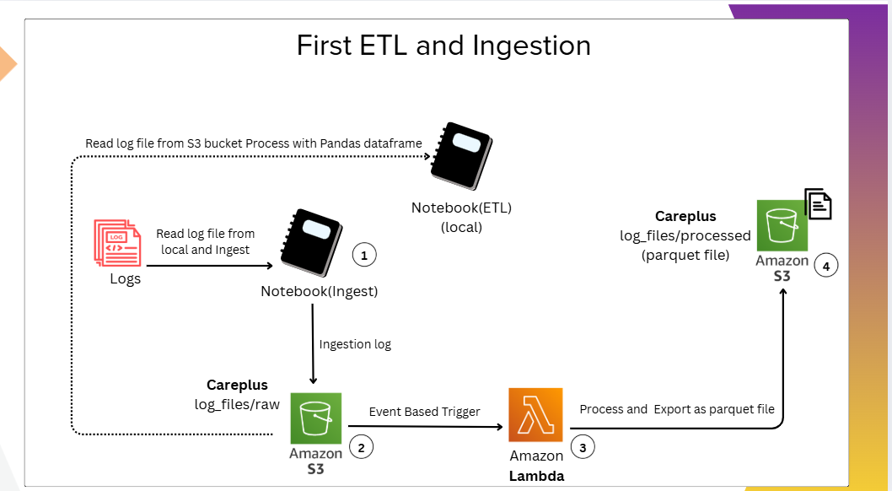

## 🎯Objective

To design and implement an event-driven log ingestion and processing pipeline using AWS services, following industry-standard data engineering practices.

## 🏗️ Architecture Overview

Source: Application .log files

Storage (Raw): Amazon S3

Processing: AWS Lambda

Trigger: S3 Event Notification

Output (Processed): Parquet files in S3

## 📘 Learning Outcomes
### 1. Amazon S3 – Log Ingestion

Created an S3 bucket for raw log ingestion.

Uploaded .log files directly into S3.

Read and validated log file content using a Jupyter Notebook.

### 2. AWS Lambda – Serverless Processing

Developed a Lambda function to fetch log files from S3.

Tested the function and deployed it successfully.

Processed raw log data programmatically.

### 3. Lambda Layers & Observability

Added external Python packages (e.g., pandas) using Lambda Layers.

Resolved Lambda timeout issues by optimizing logic and configuration.

Monitored execution, errors, and performance using CloudWatch Logs.

### 4. Event-Driven Data Pipeline

Configured S3 event triggers for the log_files/ folder.

Automatically invoked Lambda whenever a new log file is uploaded.

Transformed log data and stored it back in S3 as Parquet files for analytics.

Reference:

